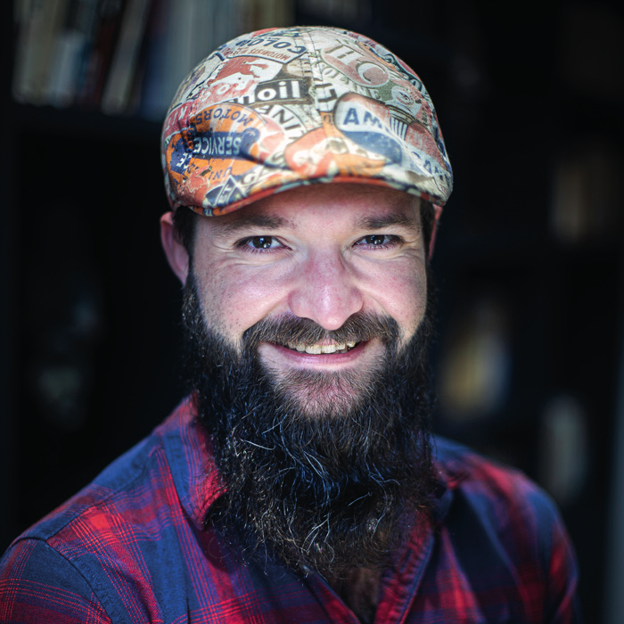

[.entrypoint]
= !
:source-highlighter: highlightjs
:revealjs_theme: black
:revealjs_progress: true
:revealjs_history: true
:customcss: ./styles/yannschepens/stylesheets/style.css
:revealjsdir: ./node_modules/reveal.js
:revealjs_defaultTiming: 40

[.intro-block]
[cols="1,2",frame=none,grid=none]
|===
a|[.yann-intro]

[.yann-name]
Yann Schepens
[.yann-role]
Tech Lead +
@onepoint
a|[.yann-intro-title]
Tricher pour mieux apprendre : 30 minutes par jour

[.yann-intro-event]
eTech Day : 19 sept. 2025
|===

include::pages/start.adoc[leveloffset=+1]
include::pages/veille.adoc[leveloffset=+1]
include::pages/choose.adoc[leveloffset=+1]
include::pages/how.adoc[leveloffset=+1]
include::pages/conclusion.adoc[leveloffset=+1]
include::pages/end.adoc[leveloffset=+1]

